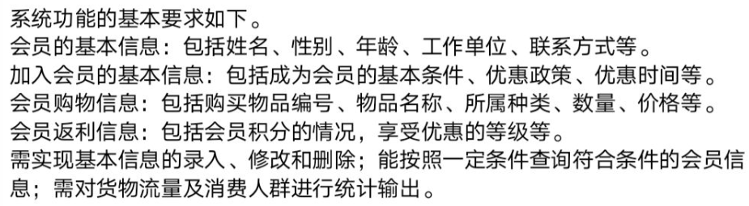
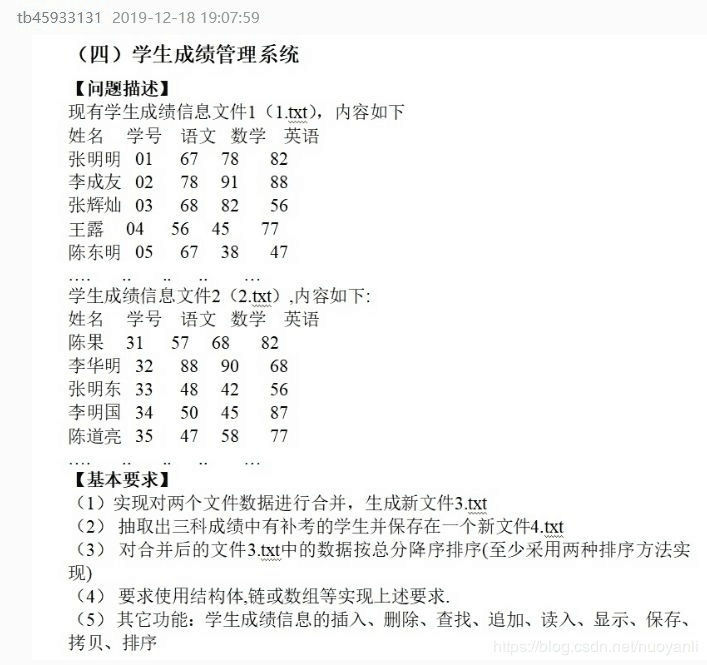

# demo-program

这是时我在学习编程时候写的一些demo程序或者帮别人写的java的程序设计作业，有需要的可以拿去参考一下。

### market-system

这是一个简单的超市管理系统，实现了对超市商品和超市员的简单管理。

**它的功能如下:**

更加详细的信息情况 market-system 中的`功能示例.docx`文件

### score-management

这是一个简答的成绩管理系统。

**它的功能如下:**

### 图书信息管理系统

这是一个使用`java`的awt和swing组件实现的一个简易图书管理系统, 没有连接数据库, 使用文件来存储数据的.

